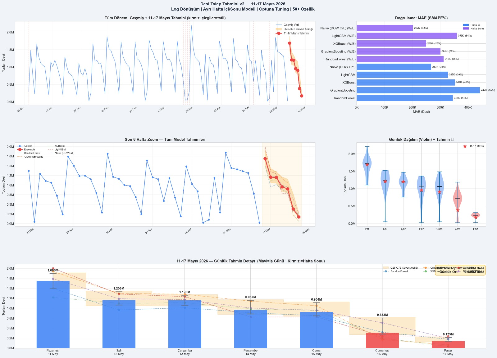
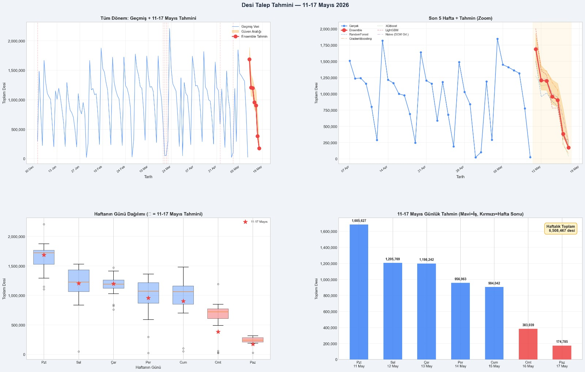

# TEKNOFEST 2026 — Akıllı Lojistik Maliyet Optimizasyon Sistemi

## Proje Özeti

Bu proje, bir kargo firmasının 11–17 Mayıs 2026 haftasına ait **günlük desi talep tahminlerini** makine öğrenmesi ile modelleyip, ardından tahmin edilen talebi **kiralık ve spot araç filolarına minimum maliyetle atayan** uçtan uca bir lojistik optimizasyon pipeline'ı sunar.

---

## Takım Bilgileri

| Alan                 | Bilgi                                          |
| -------------------- | ---------------------------------------------- |
| **Yarışma**  | TEKNOFEST 2026 — Yapay Zeka Kategorisi        |
| **Proje Adı** | Akıllı Lojistik Maliyet Optimizasyon Sistemi |

---

## Yarışma Zorunlu Parametreleri

> Aşağıdaki bilgiler jürinin resmi değerlendirme kriterleri doğrultusunda sunulmaktadır.

### **Bulunan Toplam Maliyet Bilgisi: 4.349.167 TL**

> Kiralık Araç Toplam (Günlük Kira + KM Maliyeti) + Spot Araç Toplam (FTL + Global VRP Uğrama) dahil tam operasyonel bütçe.

### **Kullanılan Kodlar (GitHub Repository Linki): [https://github.com/Ozkan-Simsek/TEKNOFEST-2026-YAPAY-ZEKA-DESTEKLI-LOJISTIK-ANAHAT-YARISMASI-MODELI.git]**

---

## Pipeline Akışı

```
tahmin.py           →  Toplam günlük desi tahmini (Ensemble ML)
tahmin_sehir.py     →  89 güzergah bazlı TM × TM talep tahmini (Pooled Model)
finalize.py         →  Global kalibrasyon (ensemble toplamıyla uyum)
map_kiralik.py      →  Kiralık hat eşleştirme (P2P, Hub-and-Spoke KAPALI)
optimize_cost_v4.py →  Kısıtlı VRP + %10 Doluluk Hard Constraint optimizasyonu
_dogrula_v6.py      →  Jüri öncesi Excel doğrulama (TEKNOFEST kural uyumu)
```

---

## Proje Sonuç Tabloları

<p align="center">
  
  
</p>

## Jüri Teslim Dosyaları

| Dosya                                | İçerik                                                                   | Satır |
| ------------------------------------ | -------------------------------------------------------------------------- | ------ |
| **`Tahminlenen_Talep.xlsx`** | Tarih\| Çıkış TM \| Varış TM \| Tahmin Edilen Desi                   | 623    |
| **`Arac_Planlamasi.xlsx`**   | Tarih\| Araç Tipi \| Çıkış TM \| Varış TM \| Atanan Desi \| Maliyet | 186    |

---

## TEKNOFEST Kural Uyumu

| Kural              | Açıklama                                                                       | Durum |
| ------------------ | -------------------------------------------------------------------------------- | ----- |
| **KURAL 1**  | Tam Maliyet — Kiralık kira + KM birleşik hesaplanır (sunk cost YOK)          | ✅    |
| **KURAL 2**  | Konsolidasyon Yasağı — Hub-and-Spoke devre dışı, her TM izole              | ✅    |
| **KURAL 3**  | Zorunlu Kiralık Araç — Tanımlı hatta her zaman kiralık araç önce atanır | ✅    |
| **KURAL 4a** | %10 Hard Constraint — Spot araçlarda zorunlu minimum doluluk                   | ✅    |
| **KURAL 4b** | Format — Tarih YYYY-MM-DD, Şehir sonunda " TM" suffix                          | ✅    |
| **KURAL 4c** | Jüri Şablonu — Resmi format sayfasına göre birebir üretildi             | ✅    |

---

## Kurulum

```bash
pip install -r requirements.txt
```

**Gereksinimler:** `pandas`, `numpy`, `scikit-learn`, `xgboost`, `lightgbm`, `optuna`, `matplotlib`, `openpyxl`

---

## Model Performansı

| Model                                              | CV MAE (Desi)              | CV SMAPE            |
| -------------------------------------------------- | -------------------------- | ------------------- |
| LightGBM + XGBoost + RandomForest + Naive Ensemble | ~2.615 desi/güzergah/gün | ~32.6% (hafta içi) |

---

*Son güncelleme: 2026-06-20*
